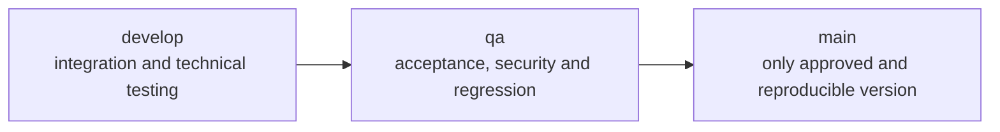
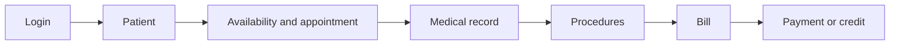

# MVP Status — Cut 1
## Functionalities linked to HU-02
| Functionality | Responsible module in the monolith | Frontend | Backend/persistence | Status |
|---|---|---|---|---|
| Basic Personnel Authentication | Auth/users | Existing login and recovery | Spring Security, JWT and PostgreSQL | Implemented; complete functional QA is missing. |
| Patients | Patients | Existing list/form | CRUD Spring/JPA/PostgreSQL | Implemented; complete functional QA is missing. |
| Agenda and appointments | Schedules/appointments | Existing calendar, schedule and appointment | Endpoints Spring/JPA/PostgreSQL | Implemented; complete functional QA is missing. |
| Clinical care/procedures | Stories/procedures | Existing views and forms | Spring/JPA/PostgreSQL | Implemented; complete functional QA is missing. |
| Billing/payments | Billing | Existing list/detail/payment | Spring/JPA/PostgreSQL | Implemented; complete functional QA is missing. |
No new functionality was developed during this task because the requested scope was analyze before modify and the inspected code already contains the candidate capabilities. The next activity is to run functional QA of the monolith and fix only proven defects.
## Observed configuration
- Branches checked in both repositories: `main`, following `origin/main`; no local `develop` or `qa` branches were observed.
- Monolith: `.env.example`, Dockerfiles, `docker-compose.yml`, PostgreSQL with volume, Angular/Nginx and Spring Boot health check.
- `dlc-docs`: documentation and future design repository; It is not the place of execution of Cut 1.
- Gateway and service contracts are retained in preparation for subsequent migration.
## Expected branch flow

No branches were created or merges were made. In `develop` they must pass unit/integration/contracts; in `qa`, E2E, authorization, data and acceptance; `main` requires approval, documentation, and versioned artifacts.
## Expected functional range
The MVP must demonstrate continuity between modules, not just isolated CRUD. The main journey begins with authentication, continues with patient and appointment, registers care and ends with invoice/payment. If any of these steps require editing PostgreSQL manually, the walkthrough is not considered complete.

## State per layer
| Layer | Observed status | To accept |
|---|---|---|
| Frontend | Components, routes, services, models and guards present. | Build, testing and complete navigation. |
| Backend | Drivers, use cases, domain, adapters and security present. | Tests and execution against PostgreSQL. |
| Data | Scheme of 15 tables and initial data. | Constraints reviewed and persistence verified. |
| Containers | Configured Dockerfiles and Compose. | Clean boot, health checks and reboot. |
| Documentation | README, Swagger and HU documents. | Consistency with demonstrated behavior. |
## Minimum functional requirements
1. An active user can log in and out.
2. An unauthorized user does not access administration.
3. A patient can register and be located without duplicating a document.
4. A dentist has consultable hours and slots.
5. An appointment can be created, viewed and changed depending on the rules implemented.
6. A medical history preserves diagnosis and procedures.
7. An invoice reflects your details and payments.
8. Data remains after restarting the app.
## Basic non-functional requirements
- secrets are not versioned;
- passwords are not saved in plain text;
- protected routes require JWT;
- errors do not reveal sensitive traces;
- amounts use decimal precision;
- the environment can be reproduced with documented instructions;
- critical actions maintain transactional consistency.
## Exclusions
They are not part of the acceptance of Cut 1: independent deployment by domain, API Gateway, event broker, outbox/inbox, MongoDB, Go, patient portal, real gateway, electronic invoice, advanced analytics or Strangler Fig migration already executed.
## Pending to declare the MVP finished
- run the full stack with valid local secrets;
- verify the flows for each role;
- increase automatic tests;
- record reproducible defects and correct blockers;
- agree on role nomenclature;
- define a delivery version and evidence.